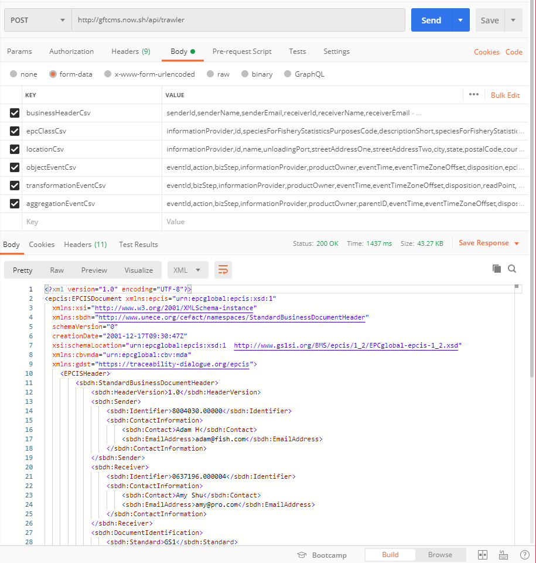

# GFTC Microservices

`gftcms` is created to expose ready-to-use services and tools that aid with software integration with the EPCIS supplychain ecosystem. A sample deployment is served at [gftcms.now.sh](http://gftcms.now.sh/). Following are available apis:

## POST /api/trawler

The `/api/trawler` route exposes a ready-to-use deployment of the [trawler library](../trawler/README.md). It accepts a form-data map with the following key and plain-text CSV value pairs:

1. `businessHeaderCsv`
2. `epcClassCsv`
3. `locationCsv`
4. `objectEventCsv`
5. `transformationEventCsv`
6. `aggregationEventCsv`

With all 6 CSVs supplied, the service returns an EPCIS XML document that can then be submited to EPCIS datastores.

